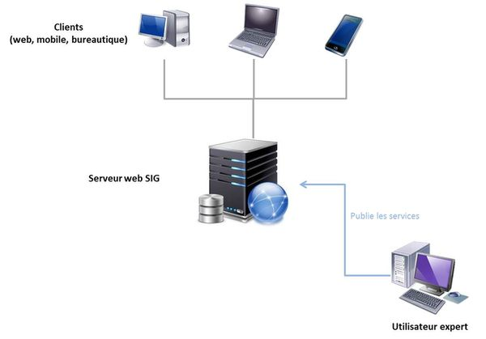

% Introduction à la programmation SIG
% Clément Delgrange
% 03/2018

# Introduction
Les SIG s'adressent à des communautés d'utilisateurs très diverses oeuvrant dans des domaines tout aussi variés : aménagement, urbanisme, travaux publics, assurance, réseaux, énergie, télécommunication, santé, production de données, etc. Bien que présentant des caractéristiques communes, les outils utilisés doivent dans le détail apporter des solutions personnalisées à chacune d'entre elles. Cela est rendu possible par le développement logiciel. Une formation aux SIG doit donc nécessairement comporter un volet consacré à la programmation de tels systèmes.

L'évolution récente du monde de l'information géographique vers la mise en ligne de données et de services (sur le web ou bien au sein de réseaux d'entreprises) a renforcé l'importance des développements. Aujourd'hui, on consomme de plus en plus l'information géographique à travers des applications web ou mobiles qui sont chacune la réponse à un besoin particulier. Ces applications et les services qu'elles consomment ce sont les développeurs SIG qui les conçoivent.
Face à ces enjeux, les éditeurs de logiciels et la communauté open source proposent des gammes de solutions plus ou moins complètes et spécifiques à une activité, du simple visualiseur à l'application sur mesure en passant par le SIG bureautique au sens historique du terme.

Cette introduction à la programmation SIG rappelera les notions de base de l'architecture des SIG pour ensuite proposer une typologie des différents développements possibles avec ces logiciels.
La suite du cours abordera alors successivement les différents aspects que nous aurons pu introduire dans cette introduction.

# Architecture d'un SIG
Un système d'information géographique (SIG) est un ensemble organisé de ressources permettant de collecter, stocker, traiter et diffuser tous type de données géographiques.
Il s'agit d'un terme générique qui englobe d'une part une **composante technologique** (logiciels, données, matériels) et d'autres part une **composante organisationnelle** (personnes et savoirs-faire liés à ces technologies)[^1].

[^1]: DENEGRE J. et SALGE F., *Les systèmes d'information géographique*, Paris, PUF (Que sais-je ?), 2004 / BORDIN P., *SIG concepts, outils et données*, Paris, Hermès, 2002.

La mise en oeuvre de ces deux composantes, organisationnelle principalement mais également technologique dans une moindre mesure, est intimement liée au domaine d'application du SIG : aménagement du territoire, gestion de réseaux, transport, télécommunication, géomarketing, recherche, etc.

Bien qu'adaptés à des contextes différents, les **logiciels SIG** ont en commun des fonctionnalités que l'on retrouve dans chaque système.
Ces fonctionnalités sont couramment regroupées en cinq familles, "les 5A" :

* **Abstraction**, pour rendre compte de la modélisation de la réalité;
* **Acquisition**, pour la collecte de données sous forme numérique;
* **Archivage**, pour le stockage des données dans un SGBD;
* **Affichage**, pour la représentation des informations;
* **Analyse**, pour la réalisation d'études

Chacune de ces fonctionnalités sera plus ou moins développée en fonction de la finalité du système d'information géographique dans l'organisation le mettant en place.

Les **données** sont dites **géographiques** lorsqu'elles sont associées à une information permettant de les localiser sur le terrain de manière explicite (coordonnées) ou implicite (adresse, nom de localité, etc.).
Le *géocodage* est le processus permettant de transformer les références géographiques implicites en références explicites.
Nous parlerons en revanche de *géoréférencement* pour décrire le processus permettant d'assigner des coordonnées à un objet qui en est dépourvu initialement. 

On distingue par ailleurs deux types de représentation des données :

* le modèle raster constitué d'une matrice de points, adapté aux phénomènes continus;
* le modèle vecteur où les informations sont regroupées sous la forme de coordonnées (points) ou successions de coordonnées (lignes, polygones), utile pour représenter les phénomènes discrets.

Si l'ordinateur de bureau a longtemps été le seul support des logiciels SIG, d'autres supports (ordinateurs portables, tablettes) permettent maintenant de traiter les données géographiques sur le terrain.

Enfin, les SIG mettent en oeuvre des ressources humaines variées (géomaticien, décideur, usager) qui vont permettre d'exploiter toute la richesse des logiciels.

La mise en oeuvre et l'exploitation d'un SIG ne peut s'envisager sans le respect de certaines règles et procédures propres à chaque organisation.

\begin{note}
**Un bref historique des SIG**
La première application reconnue de l'analyse spatiale est datée de 1854 lorsque le docteur John Snow mène une étude sur la propagation d'une épidémie de choléra dans un quartier de Londres.

Dans les années 1960 ensuite, alors que les cartes de l'époque étaient inadaptées, l'idée d'utiliser l'outil informatique pour déterminer les meilleurs lieux de plantation forestières en Afrique a fait sont apparition.

Puis à partir des années 1970, les progrès importants des technologies informatiques ont contribué à accroître le développement des SIG.
4 grandes périodes (Maguire et al. 1991) :

* 1950 -1970 : premières applications de l'informatique à la cartographie;
* 1970- 1980 : les outils SIG font leur entrée dans les organismes étatiques (armée, cadastre, services topographiques, ...) ;
* 1980 -1990 : développement de plusieurs applications informatiques dédiées aux SIG et mise en réseaux des outils SIG;
* fin des années 1990 à nos jours : développement du webmapping avec plusieurs services cartographiques offerts sur internet et apparition de plusieurs outils libres ainsi que l'usage des technologies GPS.
\end{note}

# Serveurs SIG

## Contexte
L'utilisation dans de nombreuses branches métiers (assurance, transport, groupes pétroliers, etc.) de données présentant une composante géographique n'est pas nouveau : on estime qu'en 1980, 80\% des données stockées dans les bases de données avaient une composante spatiale implicite ou explicite[^2]. Néanmoins, l'exploitation de la composante géographie est longtemps restée du seul ressort du géomaticien expert manipulant les solutions bureautiques décrites dans la partie précédente.

[^2]: FRANKLIN K., *An introduction to GIS: linking maps to databases*, 1992.

L'émergence des technologies connectés vers la fin du 20ème siècle a permis la diffusion de ces données auprès du grand public. Des initiatives comme Google Maps / Google Earth, en 2005, ont rendu possible la consultation de données géographiques par de larges communautés d'utilisateurs et ont largement démocratisé l'information géographique.

Mais ces utilisateurs nouveaux n'ont pas besoin de toute la richesse du SIG, ni les compétences pour l'exploiter. Ils recherchent simplement des interfaces utilisateurs conviviales et robustes dédiées à des activités bien précises. Ces consommateurs peuvent être le grand public ou encore les différents corps de métier manipulant des données géo-référencées dans l'exercice de leurs missions.

Il n'est donc plus question ici de SIG au sens propre du terme puisque ces nouvelles applications ne proposent pas systématiquement l'ensemble fonctionnalités au sens la règle des 5A.
On parle d'**applications web SIG**.

La consommation d'informations géographiques par des utilisateurs séparés implique nécessairement que ces informations ait été mises à disposition par une tierce personne.
Les solutions **serveurs SIG** répondent à cette problématique de partage des données.

\begin{note}
La technologie **serveur SIG** est complémentaire de la technologie **bureautique**, en ce sens qu'elle permet de diffuser ce qui a été créé avec les outils bureautiques : les données géographiques, les cartes, les modèles d'analyse et de traitement.
\end{note}

Un serveur SIG répond à trois problématiques :

1. **Héberger des ressources SIG** : le premier rôle d'un serveur SIG est bien d'héberger des ressources SIG qui seront consommées par les clients. On entend par ressource SIG les données géographiques et traitements sur ces données.
2. **Publier des ressources SIG** : afin de rendre les ressources partageables, un serveur expose ses ressources sous forme de services. Un service peut être vu comme la représentation normalisée d'une ressource, rendue de ce fait consommable par différents clients sur un réseau ; le partage peut être limité à une entreprise (intranet, réseau local), étendu à un ensemble de partenaires (extranet, accès sécurisé par identifiant et mot de passe) voire étendu à tout l'internet.
3. **Permettre d'interagir avec les ressources SIG** : il s'agit de permettre le déploiement d'applications web SIG qui consommeront les ressources publiées par le serveur sous forme de service.
Un service est destiné à être consommé par des applications de nature très différentes, développées dans des langages différents mais toutes capables d'interagir avec son interface normalisée (notion d'interopérabilité). Une telle interface s'appelle une API.

## Environnement client/serveur
L'environnement client/serveur désigne un mode de communication entre plusieurs programmes : l'un, qualifié de **client**, envoie des requêtes; l'autre, qualifié de **serveur**, attend les requêtes du client et y répond.
Par extension, le client désigne l'ordinateur sur lequel est exécuté le logiciel client et le serveur l'ordinateur sur lequel est exécuté le logiciel serveur.

Il existe une grande variété de logiciels serveurs et clients répondant à des besoins spécifiques : serveur web, serveur de messagerie électronique, serveur de données, serveur cartographique, etc. Un serveur peut par ailleurs lui-même être le client d'un autre serveur et lui envoyer des requêtes. c'est par exemple le cas du serveur web qui fera appel à un serveur de cartographique pour afficher une carte dans un navigateur. L'architecture peut être découpée en autant d'étages (ie. de couple client/serveur) que nécessaires : on parle d'\textbf{architectures n-tiers}.

Cette organisation en couche présente l'avantage de pouvoir spécialiser chacune d'entre elles dans une tâche précise et de leur allouer des ressources adaptées en fonction de ces opérations à accomplir.

\begin{note}
**Clients légers, lourds, riches**

Dans l'organisation client / serveur originel, le client envoie une requête au serveur qui effectue tous les traitements et retourne un résultat mis en forme. On parle de *client léger*.
A l'opposé, un *client lourd* support l'ensemble des traitements. Le serveur n'est, dans ce type de couple client-serveur, sollicité que pour mettre à disposition du client les données demandées.
Dans une architecture de type *client riche*, on tente de proposer un compromis pour optimiser les échanges avec le serveur. Une partie des traitements sont effectuées sur le serveur et un partie est effectuée par le client.
\end{note}

## Architectures de serveurs SIG
Ce qu'on appelle un serveur SIG est en fait une construction théorique reposant sur une architecture n-tiers qui sépare nettement ce qui touche à l'archivage des données, aux traitements métiers et au dialogue avec l'utilisateur.
Derrière ce serveur théorique se cachent donc le plus souvent plusieurs machines physiques, chacune jouant un rôle bien précis : le serveur web chargé du dialogue HTTP, le serveur proxy qui masque les autres machines, les serveurs métiers et les serveurs de données.

Dans le cas le plus simple, l'ensemble des fonctionnalités serveur sont portées par une même machine.

Une organisation plus courante consiste à séparer le serveur web du serveur cartographique.

En poursuivant la logique de spécialisation des serveurs, la partie métier peut encore être séparée en deux : un serveur de données (ArcSDE, PostGIS, etc...) et un serveur SIG "pur" dédié aux géotraitements sur les données :

\begin{note}
Les offres de données et de traitement totalement distribuées, le *cloud computing*, se sont généralisées et permettent maintenant à un grand nombre d'utilisateurs d'accéder à des fonds cartographiques et à des outils SIG.
Les géo-webservices se sont banalisés auprès du grand public et du monde de l'entreprise en quelques années seulement.
Certaines offres sont gratuites d'autres commerciales.
Dans les deux cas c'est une évolution de modèle économique importante puisqu'aujourd'hui il n'est plus toujours nécessaire d'acquérir des serveurs SIG ou de maintenir des bases de données géographiques référentielles.
Une connexion web suffit pour bénéficier de la puissance des services géographiques.
\end{note}

# Les différents types de développements SIG
La plupart des SIG proposent une interface de développement permettant de répondre à des besoins non couvert par les versions standards.
Cette partie se propose de classifier les différents types de développements possibles sous SIG.

## Développements bureautiques
proposition...

...

...

### Personnalisation
Face à des logiciels SIG souvent riches en fonctionnalités au point de les rendre parfois complexes, la plus basique des demandes des utilisateurs est de pouvoir manipuler une interface adaptée à leur usage.

En première approche, le géomaticien peut faire appel à des procédés "classiques" pour personnaliser ses applications : ajouter/supprimer des barres d'outils, en créer de nouvelles en agrégeant des boutons.
Cette approche reste néanmoins limité en terme de personnalisation.

Pour apporter plus de finesse dans la customisation de l'interface utilisateur, des interfaces de programmation sont disponibles sur certaines plateforme SIG.
Elles permettrons par exemple de ré-agencer les cadres de la fenêtre ou de manipuler des barres d'outils ou menus jusque là inaccessibles.

### Automatisation de tâches répétitives
Ce type de programmation concerne exclusivement le volet analyse des fonctionnalités des SIG (les "5A").
Le plus souvent à l'aide de scripts, le programmeur va pouvoir enchaîner plusieurs traitements que l'opérateur aurait eu à lancer manuellement.

En fonction des langages de scripts retenus par les éditeurs SIG, l'automatisation pourra être plus ou moins avancée et intégrer des structures conditionnelles et boucles pour faire varier les chaînes de traitements en fonction de l'état des données.

### Extension d'application existantes
Cette partie de la programmation sous SIG comprend le développement de plug-ins venant étendre les fonctionnalités standards d'un SIG.
Les développements pourront être plus lourds à mettre en place en fonction des technologies employées.

### Création d'application
Dans cette rubrique, le programmeur va pouvoir concevoir en intégralité des applications se basant sur les fonctionnalités de base des SIG.
L'éventail des possibilités dépendra de la manière dont les API exposent les fonctionnalités du SIG.

Ils parait important ici de souligner deux points permettant de préciser le contenu de cette catégorie de développements :

* par application, nous n'entendons par nécessairement une application dotée d'une interface graphique : un script effectuant divers géotraitements sur des jeux de données peut entrer dans cette catégorie;
* les applications développées de cette manière ne seront plus nécessairement des logiciels SIG au sens du respect de la règle des 5A : c'est par exemple le cas du script de géotraitement qui fournit une application ne permettant plus par elle même d'afficher les données.

## Développements de solutions web
Apparu dans les années 2000, les solutions web SIG font aujourd'hui parti du paysage informatique. Les éditeurs de SIG se sont adaptés à ce marché en proposant des solutions de conceptions d'applications cartographiques pour le web.

L'objectif de tels développement est de fournir aux utilisateurs finaux une application web SIG qui leur permette de travailler avec des données géographiques sans pour autant disposer de connaissances approfondies dans le domaine des SIG. L'apparente simplicité d'utilisation de certaines applications web SIG cache en réalité une analyse du besoin avancée et des développements parfois pointus qui visent à composer une application à partir : d'un fond de carte, d'une(de) couche(s) métier, d'outils et de bases de données géographiques.

## Développements de solutions mobiles
Secteur en pleine extension, il s'agit de concevoir des applications nomades grand public fonctionnant sur les principaux OS du marché des smartphones.

Si les éditeurs de SIG proposent quasiment tous des solutions pour mobiles (smartphone, tablettes ou support spécifique), la liste de ceux permettant la conception ou personnalisation de tels applications est encore réduite.

La logique de conception d'une solution mobile est similaire à celle de conception d'une solution web : il s'agit de proposer une application métier simple d'usage pour un utilisateur final ayant peu de connaissance des SIG.
