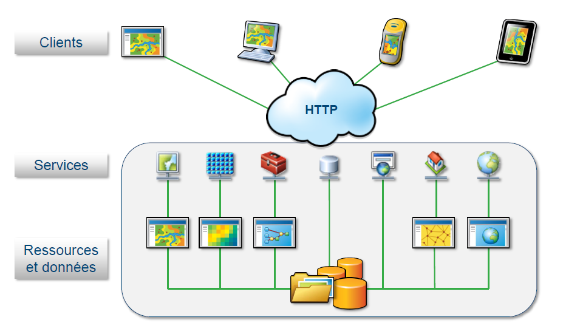

% Programmation sous SIG
% M1 Géomatique
% 03/2018

# Introduction #

## Organisation du cours ##

* 8 séances de TD
* TD notés

## Programme ##

0. Qu'est qu'un SIG ? Quels développements sous SIG ?
1. Exploitation de données vecteur avec Python
2. Exploitation de données raster avec Python
3. Le système ArcGIS / ArcGIS pour le développeur
4. Python et QGIS

# Généralités #

## Définition ##

> Un système d'information géographique (SIG) est un ensemble organisé de ressources pour collecter, stocker, traiter et diffuser de l'information géographique.

## Composantes d'un SIG ##

* Des aspects multiples
	* **composante technologique** : logiciels, données, matériels
	* **composante organisationnelle** : personnes, savoirs-faire
* Des fonctionnalités communes : *règle des 5A*

## Les 5A ##

* **Acquisition** : collecter de la données sous forme numérique
* **Affichage** : restituer graphiquement l'information
* **Abstraction** : rendre compte de la modélisation de la réalité
* **Analyse** : réaliser des études
* **Archivage** : stocker les données dans un SGBD

## Données géographiques ##

* Donnée géographique = associée à une information permettant de la localiser
 	* localisation *explicite*
	* localisation *implicite*
* Géocodage = transformer l'implicite en explicite
* Géoréférencement = assigner des coordonnées à un objet

## Types de représentation ##

* modèle raster => matrice de points
* modèle vecteur => coordonnées ou successions de coordonnées

## Evolution des SIG ##

* 1970 : SIG bureautique réservé aux spécialistes
	* "faire des cartes"
* 1980-90 : diffusion dans d'autres corps de métiers
	* armée, cadastre...
* 2000 : démocratisation de l'information géographiques
	* sites comme GoogleMap
* Aujourd'hui : grand public consommateur régulier d'information géographique
	* usages multiples (géolocalisation, calculs d'itinéraires...)
	* plateformes variées (PC, smartphone...)
	* nombreux utilisateurs

## Aujourd'hui ##

* Nombreux utilisateurs
	* y compris grand plublic
* Besoins variés

=> importance des développements

# Le serveur SIG #
##  ##

* Fonctionnalités attendues d'un serveur SIG
	* Héberger des ressources SIG
	* Publier des ressources SIG
	* Permettre d'interagir avec les ressources SIG

## Partage de ressources ##			

* Ressources partagées sous forme de **services**

## Des architectures de serveur SIG ##

## Des architectures de serveur SIG ##

# Développements sous SIG #

## Intérêt des développements ##

* Répondre aux besoins non couverts en standard
 	* faciliter des opérations
 	* automatiser des géotraitements
	* simplifier des applications métier
	* *sortir le SIG du bureau*
	* ...

## Types de développements ##

* Développements bureautiques
	* personnalisation
	* automatisation
	* extensions
	* création d'applications
* Développements de solutions web
* Développements de solutions mobiles

## Quels SIG pour développer ##

* Des interfaces de développement dans tous les SIG

## Quels SIG pour développer ##

## Quels SIG pour développer ##

## Quels SIG pour développer ##

