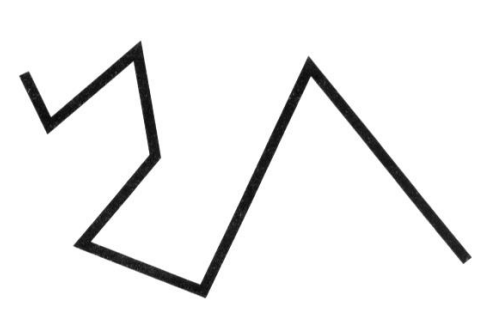
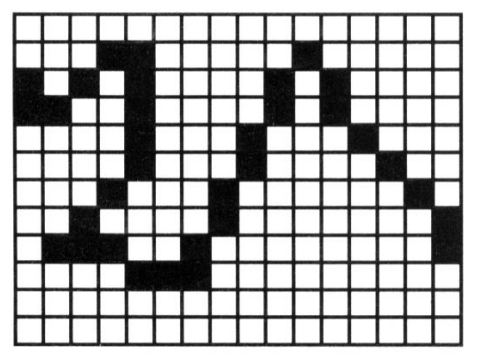
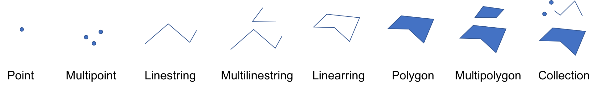
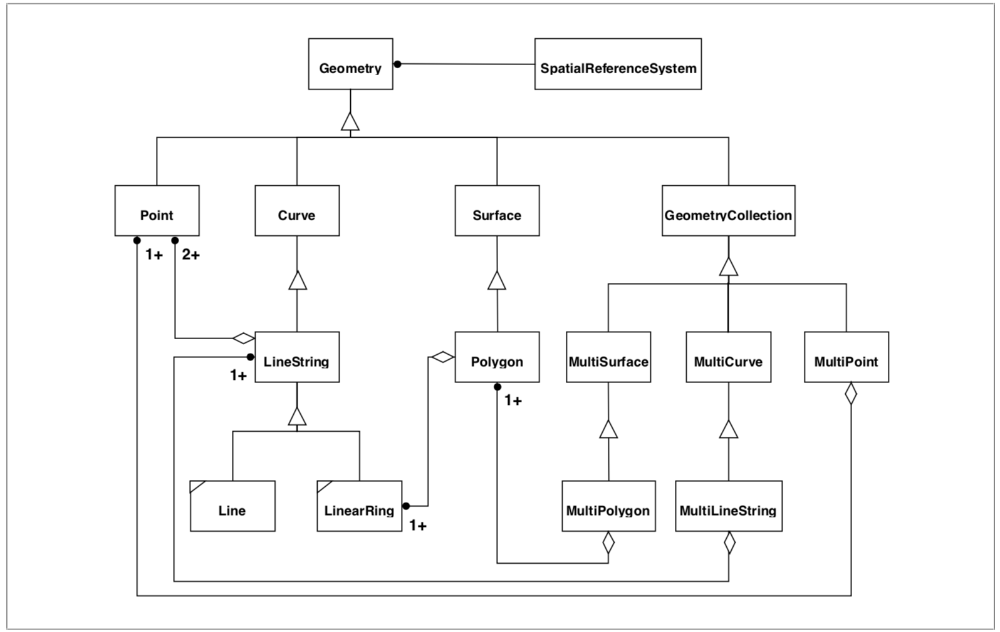
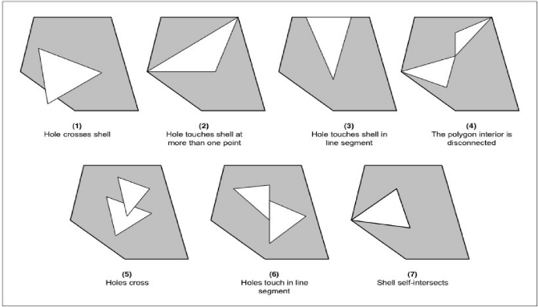
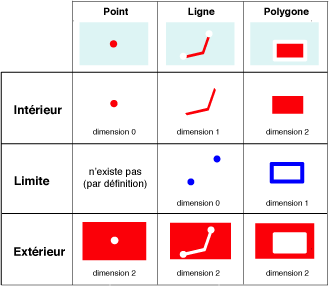

% Utilisation de données vecteur avec Python
% Clément Delgrange
% 03/2018


# Objectifs

* Connaître les différentes primitives géométriques
* Manipuler des objets géolocalisés et effectuer quelques opérations spatiales
* Ouvrir des fichiers géographiques de différents formats, dans différentes projections
* Visualiser les données géolocalisées, créer des cartes statiques et interactives


# Introduction
La première partie du cours nous a permis d'établir un panorama des possibilités offertes par l'ensemble des techniques de programmation SIG.
Dans ce chapitre nous nous proposons d'aborder la programmation SIG en laissant le SIG bureautique traditionnel de côté.
Au lieu de cela, nous préférons nous concentrer sur la base de notre métier : la donnée géographique.
Nous commencerons ainsi par un bref rappel des modes de représentation de l'information géographique.
Puis nous verrons comment le langage de programmation Python nous permet de manipuler cette information géographique : manipulation de géométries vecteur, opérations spatiales, gestion des projections, représentation, etc.
Nous nous situerons donc ici plutôt dans la dernière des catégories de développements SIG que nous avons établit dans la première partie de ce cours, les applications autonomes, même si les techniques apprises ici pourrons nous être utiles pour développer, par exemple, des plugins pour un SIG.


## Le choix de Python comme langage de programmation
Dans cette partie, comme dans beaucoup de suivantes, nous utiliserons exclusivement le langage de programmation Python.
Aujourd'hui Python est probablement le langage de programmation le plus utilisé en géomatique.
L'écosystème Python s'est enrichi ses dernières années de nombreuses libraires à visées géospatiales.
C'est aussi le langage que les SIG ont choisi depuis plusieurs années pour exécuter des scripts de géotraitements (ArcGIS, QGIS, etc.).
Nous pouvons évoquer plusieurs raisons à cela:

* sa facilité d'utilisation et d'apprentissage pour des "non informaticiens";
* il est gratuit et open-source;
* il est assez facilement intégrable à d'autres langages (`C`, `C++`);
* de nombreuses libraires de calculs numériques existent (`numpy`, `scipy`, `pandas`, etc.);
* les libraires fondamentales de la géomatique (`PROJ.4`, `GDAL`, etc.) bénéficient de bindings Python.


# Représentation de l'information géographique

## Raster vs. vecteur
Deux façons de stocker les données géolocalisées : le mode vecteur et le mode raster.
Ces deux modes permettent de représenter la même information mais le font de manière différente.

En mode raster, le monde réel est représenté sous la forme de matrice où chaque case prend une valeur reflétant la valeur de l'information à représenter.
Des matrices multi-dimensionnelles (ie. à plusieurs bandes) sont fréquemment utilisées pour représenter les phénomènes complexes.



Le mode vecteur représente l'information géographique sous forme de géométries.



Les géométries peuvent être dotées d'un sémantique (ie. des attributs) et liées entre elles grâce à des liens de topologies (ex : deux routes données sont connectées en un carrefour, ne sont pas connectées, se croisent à un pont mais ne sont pas connectées, etc.).

Si les rasters sont plus faciles à créer, l'analyse des données vecteur est plus aisée.
Dans la suite de cette partie nous nous focaliserons sur les données vecteur, tandis que la prochaine partie reviendra sur les données raster.


## Les primitives géométriques
Dans le mode vecteur le monde réel est donc représenté à l'aide de géométries. Dans sa norme *Simple Feature Access*[^1], l'Open Geospatial Consortium (OGC) définit huit primitives géométriques :



[^1]: <http://www.opengeospatial.org/standards/sfa>

\begin{note}
"L'Open Geospatial Consortium, ou OGC, est un consortium international pour développer et promouvoir des standards ouverts, les spécifications OpenGIS, afin de garantir l'interopérabilité des contenus, des services et des échanges dans les domaines de la géomatique et de l'information géographique." (source Wikipedia)

Les principaux acteurs du marché (Esri, Oracle, etc.) ainsi que des instituts nationaux sont membre de l'OGC.
Aussi il est fort probable qu'une norme publiée par l'OGC soit aussitôt reprise par l'ensemble de la communauté géomatique.
\end{note}

Le modèle géométrique complet vous est donné ci-dessous.
Il nous intéresse pour comprendre comment sont structurées les données géographiques vecteur.
Vous constaterez, qu'en plus des huit primitives géométriques, d'autres classes abstraites sont introduites pour donner du sens au modèle et lier les primitives géométriques entre elles.



Ce modèle nous intéresse également parce qu'il est repris dans la plupart des outils que nous utiliserons.
C'est notamment le cas de la librairie GEOS maintenue par la Fondation Open Source Geospatial (OSGeo) qui occupe une place centrale dans le monde de la géomatique.
Basée sur la Java Topology Suite (JTS)[^2], cette librairies est notamment utilisée dans PostGIS ou `shapely` que nous utiliserons dans la suite de ce chapitre.

[^2]: <https://github.com/locationtech/jts>

\begin{note}
"La Fondation Open Source Geospatial (OSGeo) est une organisation non gouvernementale fondée en 2006 pour soutenir et construire une offre de logiciels open source en géomatique." (source Wikipedia)

Alors que l'OGC édite des normes favorisant l'interopérabilité et les échanges de données, l'OSGeo soutient le développement d'outils open source mettant en oeuvre ces normes.
\end{note}


## validité des géométries
Au delà d'une simple hiérarchie entre les objets géométriques, la norme *Simple Feature Access* définie également des règles de validité pour chacune des géométries.

Ci dessous nous présentons quelques exemples de polygones invalides.
Des règles similaires existent pour les autres types de géométries (lignes auto-intersectées, etc.).




## Les opérations spatiales

Enfin, la norme *Simple Feature Access* définit les opérations spatiales permises pour chaque type de géométrie.
Ce sont les opérations spatiales que l'on retrouve dans les outils SIG communs :

* buffer, rectangle englobant, enveloppe convexe, etc. pour les opérations n'impliquant qu'une seule géométrie;
* intersections, union, différence, différence symétrique, etc. pour les opérations impliquant plusieurs géométries.


## La librairie `shapely`
Le module `shapely` a été créé par Sean Gillies pour permettre d'effectuer, avec un syntaxe *pythonique*, ce qu'il est possible de faire avec GEOS pour manipuler et analyser des géométries.
Aussi tout comme GEOS, `shapely` reprend une bonne part des principes exposés dans la norme *Simple Feature Access* de l'OGC.

`shapely` ne traite que des géométries et ne s'intéresse pas aux formats de données (lecture/écriture de fichiers) ou encore aux reprojections.
Il s'agit d'un parti pris de Sean Gillies qui a par ailleurs travaillé sur d'autres librairies pour ces taches : par exemple `fiona` pour la lecture/écriture de shapefiles ou `affine` pour effectuer des transformations affines.

Les notions d'*intérieur* (interior), de *frontière* (boundary) et d'*extérieur* (exterior) sont introduites par la librairie.
L'union de ces trois ensemble correspond à l'ensemble du plan.

* l'intérieur d'un point est égale au point lui même, sa frontière est nulle et l'extérieur correspond à tous les autres points;
* pour une ligne (linestring ou linearring), l'intérieur équivaut à l'ensemble des points sur sa longueur, la frontière aux deux extrémités et l'extérieur au reste des points;
* pour un polygone, l'intérieur est composé des points à l'intérieur de celui-ci, la frontière à une ou plusieurs lignes constituant le contour du polygone et l'extérieur au reste des points (y compris ceux à l'intérieur des trous).



La syntaxe pour créer des géométries avec `shapely` est la suivante :
```
>>> from shapely.geometry import Point,
>>> pt = Point([2, 3])
>>> ls = LineString([[0, 0], [1, 1], [2, 0]])
>>> poly = Polygon([[0, 0], [1, 1], [2, 0], [0, 0]])
```

Une fois la géométrie définie, il est ensuite possible d'accéder à certaines propriétés :
```
>>> ls.bounds  # rectangle englobant de la ligne
(0.0, 0.0, 2.0, 1.0)
>>> poly.area  # aire du polygone
1.0
>>> poly.exterior  # linearring constituant le contour extérieur
<shapely.geometry.polygon.LinearRing at 0x107d3d6a0>
```

Les coordonnées d'un objet s'obtiennent à l'aide de la propriété `coords` qui renvoie un objet de type `CoordinateSequence`.
Pour pouvoir afficher les coordonnées, on peut le transformer en liste :
```
>>> ls.coords  # objet CoordinateSequence de la linestring
<shapely.coords.CoordinateSequence at 0x107d3d278>
>>> list(ls.coords)
[(0.0, 0.0), (1.0, 1.0), (2.0, 0.0)]
>>> list(poly.exterior.coords)
[(0.0, 0.0), (1.0, 1.0), (2.0, 0.0), (0.0, 0.0)]
```

Il est aussi possible d'effectuer des opérations géométriques :
```
buff = pt.buffer(2)  # retourne le polygone construit en effectuant un buffer de 2 autour du point
```

La documentation complète de la librairie se trouve à l'adresse suivante : <https://shapely.readthedocs.io>.


## Exercices
1. Ecrire une fonction prenant une liste de point `shapely` et retournant deux éléments :
  * un booléan indiquant si le polygone `shapely` dont le contour extérieur est constitué de la suite de points est valide;
  * une chaîne de caractère détaillant le motif d'invalidité (ou une chaîne vide s'il est valide).
2. Ecrire une fonction qui prend en entrée deux linestrings et retourne leur intersection.
Le deux linestring et l'intersection seront ensuite dessinées dans un graphique matplotlib.
3. Ecrire un programme qui prend en entrée un fichier csv[^3] contenant les coordonnées d'une liste de points et une distance `dist_ref` et qui retourne un booléen indiquant si un point se situe à une distance supérieure à `disr_ref` de tous les autres points ou si chacun des points se situe à moins de `dist_ref` d'un autre point.

[^3]: Comma-separated Values (CSV) : format représentant des données tabulaires sous forme de de valeurs séparées par des virgules.

### Indices
1. L'essentiel de la documentation de `shapely` peut se retrouver sur une seule page web à l'adresse : <https://shapely.readthedocs.io/en/latest/manual.html>.
Essayer d'y effectuer une recherche avec un mot clé adéquat (en anglais ;-)).
2. Les instructions suivantes permettent d'afficher un point puis une ligne dans un graphique matplotlib :
```
import matplotlib.pyplot as plt

plt.plot(2, 3)  # dessine le point (2, 3)
plt.plot([0, 1, 2], [0, 1, 0])  # dessine la ligne [(0, 0), (1, 1), (2, 0)]
plt.show()
```
Vous pouvez consulter la documentation de la fonction `plot` pour avoir plus d'options d'affichage (couleurs, formes, etc.) : <https://matplotlib.org/api/pyplot_api.html#matplotlib.pyplot.plot>.
3. Un ficheir csv est un fichier texte. Vous pouvez le lire comme un fichier texte classique ou utiliser une librairie adaptée.


# Les formats d'échange
Depuis une trentaine d'années, les SIG se sont implantés dans de nombreux domaines.
Diverses solutions commerciales se sont développées permettant à l'utilisateur un vaste choix parmi ces solutions.
Cette diversité de solutions implique une diversité de formats, chaque éditeur de logiciel étant à l'origine de sont propre format.

Lorsque les utilisateurs cherchent à faire communiquer leurs applications, ils sont confrontés au problème de l'*interopérabilité* : la capacité des système à s'échanger et se partager des données.

Dans ce contexte nous distinguerons les formats dits *ouverts* (pensons aux shapefiles d'Esri) de ceux dits *fermés* (les géodatabases d'Esri).
Par ouverts/fermés nous entendons que les spécifications de ces formats sont respectivement publiques ou pas.
Naturellement des formats ouverts permettent l'interopérabilité des données tandis que les formats fermés la limite en imposant l'utilisation d'un logiciel particulier.

La problématique sera identique pour le développeur : un format ouvert sera manipulable au travers de différentes librairies.
Les formats fermés ne le seront généralement que via les librairies de l'éditeur de SIG propriétaire du format.

Aujourd'hui les données ont de plus en plus besoin d'être échangées entre divers acteurs.
On comprendra alors aisément que l'importance des formats ouverts dans ce contexte.

Pour les données vecteur, l'OGC a mis en avant le *well-known text* (WKT) dans la norme *Simple Feature Access* pour décrire de manière textuelle tous les types de géométrie.
D'autres formats permettant d'inclure des informations sémantiques sur les géométries ont également été mis en oeuvre par la communauté : le GeoJSON, le GML, etc.
Parmi eux le **GeoJSON** semble aujourd'hui être plébiscité par la communauté SIG pour manipuler les données vecteur.


## Le GeoJSON
Basé sur le format JSON (JavaScript Open Notation), le GeoJSON permet de représenter toutes les primitives géométriques définies par l'OGC.
Il est lisible par un humain et manipulable par la plupart des libraires géospatiales ainsi que par les principaux SIG du marché.

\begin{note}
Le format JSON (JavaScript Open Notation) est un format textuel qui permet de représenter une information structurée.
Il est fréquemment utilisé comme format d'échange dans le monde du web en raison de sa facilité de mise en oeuvre.
Un document JSON ne comporte que deux types d'éléments : des couples clé/valeur et des listes ordonnées de valeurs.
Les types permis pour les valeurs sont : nombres, chaînes de caractères, booléens, null, liste ordonnées ou objet JSON.
\end{note}

La structure du GeoJSON est celle d'un dictionnaire en Python. Les différents types de géométries sont listés dans le tableau suivant :

\begin{tabular}{|c|l|}
	\hline
	Point &
	\begin{lstlisting}
{ "type": "Point",
    "coordinates": [30, 10]
}
	\end{lstlisting} \\
	\hline
	Polyligne &
	\begin{lstlisting}
{ "type": "LineString",
    "coordinates": [
        [30, 10], [10, 30], [40, 40]
    ]
}
	\end{lstlisting} \\
	\hline
	\begin{tabular}{c}
		Polygone \\
		(y compris avec trous)
	\end{tabular} &
	\begin{lstlisting}
{ "type": "Polygon",
    "coordinates": [
        [[35, 10], [45, 45], [15, 40], [10, 20], [35, 10]],
        [[20, 30], [35, 35], [30, 20], [20, 30]]
    ]
}
	\end{lstlisting} \\
	\hline
	Multi-point &
	\begin{lstlisting}
{ "type": "MultiPoint",
    "coordinates": [
        [10, 40], [40, 30], [20, 20], [30, 10]
    ]
}
	\end{lstlisting} \\
	\hline
	Multi-polyligne &
	\begin{lstlisting}
{ "type": "MultiLineString",
    "coordinates": [
        [[10, 10], [20, 20], [10, 40]],
        [[40, 40], [30, 30], [40, 20], [30, 10]]
    ]
}
	\end{lstlisting} \\
	\hline
	Multi-polygone &
	\begin{lstlisting}
{ "type": "MultiPolygon",
    "coordinates": [
        [
            [[40, 40], [20, 45], [45, 30], [40, 40]]
        ],
        [
            [[10, 30], [10, 10], [40, 5], [40, 30], [20, 35]],
            [[30, 20], [20, 15], [20, 25], [30, 20]]
        ]
    ]
}
	\end{lstlisting} \\
	\hline
\end{tabular}

Une entité géométrique `Feature` possède une balise `geometry` et une balise `properties` pour la sémantique de la géométrie:
```
{
  "type": "Feature",
  "geometry": {
    "type": "Polygon",
    "coordinates": [
      [
        [100.0, 0.0],
        [101.0, 0.0],
        [101.0, 1.0],
        [100.0, 1.0],
        [100.0, 0.0]
      ]
    ]
  },
  "properties": {
    "nom": "Paris",
    "population": 2000000
  }
}
```

Le type `FeatureCollection` permet de regrouper un ensemble de géométries de types différents au sein d'une même entité géométrique :

```
{ "type": "FeatureCollection",
    "features": [
      { "type": "Feature",
        "geometry": {
          "type": "Point",
          "coordinates": [...]
        },
        "properties": {
          "prop0": "value0"
        }
      },
      { "type": "Feature",
        "geometry": {
          "type": "LineString",
          "coordinates": [...]
        },
        "properties": {
          "prop0": "value0",
          "prop1": 0.0
        }
      },
      { "type": "Feature",
         "geometry": {
           "type": "Polygon",
           "coordinates": [...]
         },
         "properties": {
           "prop0": "value0",
           "prop1": 123456
           }
         }
       ]
     }
```


## Le protocole `__geo_interface__`
Sean Gillies a proposé un protocole pour représenter les informations géographiques vecteur dans Python en se basant sur le GeoJSON : <https://gist.github.com/sgillies/2217756>
Ce protocole est adopté petit à petit par la communauté Python géomatique et les les principales libraires l'implémentent maintenant (`shapely`, `arcpy`, `geojson`, `PySAL`, etc.).

Par exemple avec `shapely`, les instructions suivantes retournent la représentation GeoJSON d'un multipoint :

```
>>> from shapely.geometry import MultiPoint
>>> mpt = MultiPoint([[0, 0], [1, 0], [0, 1], [1, 1]])
>>> mpt.__geo_interface__
{'coordinates': ((0.0, 0.0), (1.0, 0.0), (0.0, 1.0), (1.0, 1.0)),
 'type': 'MultiPoint'}
```


## Les fichiers de formes
Le format shapefile, ou *fichier de formes*, a initialement été développé par Esri pour ses logiciels SIG.
Aujourd'hui les spécifications de ce format ont été rendues publiques, ce qui lui a permis petit à petit de s'imposer comme un standard.
Il est lisible dans la majorité des logiciels du marché de la géomatique : ArcGIS, QGIS, Autodesk Map, Grass, GvGIS, MapServer, etc.

Un fichier de forme est toujours composé de plusieurs fichiers portant nécessairement le même nom :

* le `.shp` contenant les géométries;
* le `.dbf` stockant les informations sémantiques relatives aux géométries;
* le `.shx` qui stocke un index des géométries.

D'autres fichiers annexes peuvent être présents. Citons notamment :

* un index spatial (`.sbx`);
* la définition du système de coordonnées utilisé (`.prj`).

Pour ouvrir un fichier de formes en Python, nous pouvons utiliser la librairie `fiona` (<https://toblerity.org/fiona/>).

La syntaxe pour ouvrir un fichier est semblable à celle d'ouverture d'un fichier "classique", à ceci près que l'itération sur le contenu du fichier ouvert retourne la `__geo_interface__` des géométries du shapefile :

```
>>> import fiona
>>> with fiona.open('test.shp', 'r') as shp_file:
...     for geom in shp_file:
...         print(geom)
...
{'coordinates': (0.0, 0.0), 'type': 'Point'}
{'coordinates': (2.0, 0.4), 'type': 'Point'}
{'coordinates': (4.0, 2.0), 'type': 'Point'}
```


## Exercices
Le format gpx est un format d'échange de données GPS, notamment utilisé par les montres GPS de sport[^4].
Il est basé sur le langage de balise XML.

[^4]: Norme GPX : <http://www.topografix.com/GPX/1/1/>

Créer une fonction prenant en entrée un fichier gpx et retournant une géométrie shapely représentant la trace contenue dans le fichier.
Tester votre fonction avec le fichier `trace.gpx`.

Ecrire ensuite une seconde fonction permettant d'écrire un fichier GeoJSON à partir de la géométrie shapely précédente.

### Indices
Pour lire le fichier gpx, plusieurs possibilités sont envisageables :

* lire le fichier comme un ficher texte et analyser son contenu : solution longue, fastidieuse et source d'erreurs;
* utiliser une librairie de lecture de fichiers XML : envisageable avec un peu de connaissance sur le contenu du gpx;
* utiliser une librairie dédiée à la lecture de fichier gpx, comme par exemple `gpxpy` (<https://github.com/tkrajina/gpxpy>) qui permet de parser un fichier gpx (`gpxpy.parse(gpx_file)`). Regarder l'exemple du dépôt github du projet pour comprendre comment exploiter le résultat.


# Les projections
Une information géographique géolocalisée est définie à l'aide de coordonnées exprimées dans un système de coordonnées.
Nous avons vu comment manipuler des géométries avec `shapely` et nous allons donc maintenant aborder quelques aspects liés aux systèmes de coordonnées.

Assez fréquemment les différentes couches que nous allons manipuler dans un SIG ne seront pas définies dans le même système de coordonnées.
Aussi pour pouvoir les mettre en relation, nous allons devoir les reprojeter.

La librairie fondamentale pour effectuer des reprojections et PROJ.4.
Ecrite en C, elle offre une API permettant de convertir des coordonnées de n'importe quel système de coordonnées vers n'importe quel autre.
Un binding Pyhton de cette librairie existe heureusement : `pyproj`.

La projection d'une couche dans un SIG est souvent définie à l'aide d'un code EPSG.

\begin{note}
L'European petroleum survey group (EPSG) est un groupe qui a défini une liste de systèmes de coordonnées et a associé à chacun d'eux un code unique. Aujourd'hui les codes de l'EPSG sont utilisés dans les standards de l'OGC. Voir \url{www.epsg.io} pour retrouver les informations sur un projection.
\end{note}

D'autres formalismes existent pour représenter les systèmes de coordonnées.
Nous rencontrerons par exemple fréquemment des chaînes PROJ.4 ou d'un WKT normalisé par l'OGC.

Exemples de PROJ.4 et de WKT pour la projection NAD83 / Virginia North (EPSG:2283) :

```
PROJ.4 : '+proj=lcc +lat_1=39.2 +lat_2=38.03333333333333 +lat_0=37.66666666666666 +lon_0=-78.5 +x_0=3500000.0001016 +y_0=0 +ellps=WGS84 +units=m +no_defs '

OGC WKT :
PROJCS["unnamed",
    GEOGCS["WGS 84",
        DATUM["unknown",
            SPHEROID["WGS84",6378137,298.257223563]],
        PRIMEM["Greenwich",0],
        UNIT["degree",0.0174532925199433]],
    PROJECTION["Lambert_Conformal_Conic_2SP"],
    PARAMETER["standard_parallel_1",39.2],
    PARAMETER["standard_parallel_2",38.03333333333333],
    PARAMETER["latitude_of_origin",37.66666666666666],
    PARAMETER["central_meridian",-78.5],
    PARAMETER["false_easting",3500000.0001016],
    PARAMETER["false_northing",0]]
```

La syntaxe pour transformer la coordonnées (49; 2,5) exprimée en WGS 84 vers du Lambert 93 à l'aide de `pyproj` est :
```
>>> import pyproj
>>> p1 = pyproj.Proj(init="EPSG:4326")  # WGS 84
>>> p2 = pyproj.Proj(init="EPSG:2154")  # Lambert 93
>>> pyproj.transform(p1, p2, 49, 2.5)
(6966447.11991473, 3144085.7531701634)
```

La limite de cette librairie est bien entendu qu'elle ne permet de transformer que des points (ou listes de points) et pas des géométries directement.
Pour des reprojections de plus haut niveau, nous pouvons nous tourner vers le module `osr` de la librairie `osgeo`.
Moins intuitive dans son utilisation, cette librairie permet des reprojections de jeux de données complets.

Vous pouvez retrouver quelques exemples d'utilisation du module `osgeo.osr` ici : <https://pcjericks.github.io/py-gdalogr-cookbook/projection.html>.


## Exercices
1. Ecrire une fonction permettant de transformer n'importe quelle type de géométrie au format GeoJSON d'un système de coordonnées vers un autre.
2. Considérons un polygone dont la représentation WKT est :
`POLYGON ((25.80954551696777 66.55355747998166, 25.85220336914062 66.57588240547837, 25.85108757019043 66.57622360944596, 25.808687210083 66.55386483992372, 25.80954551696777 66.55355pandoc -s -N --listings --template=template/template.latex -o747998166))`.
Les coordonnées de ce polygone sont exprimées en latitude / longitude (WGS84).
Calculer l'aire d'un polygone en pseudo Mercator et en UTM zone 35N.
Quel est le bon résultat?


### Indices
1. Effectuer un type sur le type de la géométrie décrite dans le GeoJSON et en fonction du résultat appliquer un traitement différent en utilisant `pyproj`.
2. Utiliser la fonction précédente pour transformer le polygone.
Le module `shapely` permet de créer une géométrie directement à partir d'un WKT.


# Créer des cartes
Nous avons vus précédemment comment manipuler des géométries, effectuer des opérations spatiales, gérer les systèmes de coordonnées.
La problématique ce cette partie tient à la représentation des données produites.

Dans un premier temps, nous verrons comment réaliser une carte statique.
Puis nous introduirons plus de de dynamisme dans les cartes produites.

## Cartes statiques
Par carte statique, nous entendons une carte avec laquelle l'utilisateur ne peut pas interagir (sélectionner, zoomer, déplacer).
Il s'agit classiquement d'une simple image représentant les données géographiques traitées.

Les solutions en Python pour générer des cartes sont nombreuses : `mapnik`, `basemap`, `cartopy`, `descartes`, `bokeh`, etc.
Nous nous attarderons sur la librairie `descartes` (<https://bitbucket.org/sgillies/descartes/>), développée par Sean Gillies, comme la plupart des outis étudiés dans cette partie.
Cette librairie permet d'insérer des cartes dans des graphiques `matplotlib`.

Nous commencerons par montrer comment dessiner des rectangles dans un graphique `matplotlib`.
La technique sera similaire pour ajouter une carte avec `descartes`.

Les fonctions suivantes nous serons utiles :

* `matplotlib.figure()` : élément de plus haut niveau permettant de contenir les éléments d'un graphique;
* `matplotlib.figure().gca()` pour *get current axes* récupère les axes d'une figure matplotlib ou en crée si besoin;
* `add_patch()` pour ajouter des éléments en utilisant les axes du graphique .

L'exemple ci-dessous insère deux rectangles dans un graphique :
```
import matplotlib.pyplot as plt

fig = plt.figure()
fig.gca().add_patch(plt.Rectangle((0, 1), 1, 1))
fig.gca().add_patch(plt.Rectangle((3, 1), 1, 1))
fig.gca().autoscale()
plt.axis("equal")
plt.show()
```

La méthode `autoscale()` est nécessaire pour centrer le graphique sur les rectangles insérés, tandis que `plt.axis("equal")` permet d'avoir une même échelle selon les deux axes.

Pour ajouter une carte à un graphique la méthode sera strictement identique.
L'objet `PolygonPatch` est utilisé pour représenter un polygone défini en GeoJSON.

```
import matplotlib.pyplot as plt
from descartes import PolygonPatch
from shapely.geometry import Polygon

geom1 = {
    "type": "Polygon",
    "coordinates": [[[0, 1], [1, 1], [1, 2], [0, 2], [0, 1]]]
}
geom2 = Polygon([[3, 1], [4, 1], [4, 2], [3, 2], [3, 1]])

fig = plt.figure()
fig.gca().add_patch(PolygonPatch(geom1))
fig.gca().add_patch(PolygonPatch(geom2))
fig.gca().autoscale()
plt.axis("equal")
plt.show()
```

Des options permettent naturellement de spécifier la couleur, la transparance ou encore la bordure des géométries dessinées.


## Cartes interactives
Pour pouvoir naviguer dans la carte générée, nous allons faire appel à d'autres outils.
La librairie `Folium` (<https://folium.readthedocs.io/en/latest/>) qui permet de générer une page HTML incluant une carte Leaflet.

La création de la page HTML s'effectue simplement de la manière suivante :
```
carte = folium.Map(location=[48, 3], zoom_start=8)
carte.save("ma_carte.html")
```

On ajoute ensuite des éléments dans la carte :

* des points : `folium.Marker([lat, lon]).add_to(carte)`;
* des linestring : `folium.PolyLine(polyline, color='red', weight=5).add_to(carte)`;
* des polygones;
* des GeoJSON directement;
* etc.


## Exercice
En repartant du fichier `trace.gpx` déjà utilisé pour un exercice précédent, représenter la trace GPS contenue dans le fichier :

1. dans une carte réalisée avec la librairie `descartes`
2. en la superposant à un fond de carte OpenStreetMap en utilisant la librairie `Folium`


# Exercice final
Consignes :

* Les données (`points_EPSG-27561.csv`) représentent des ensembles de points;
* Pour chacun de ces groupes, il s’agit d’afficher ces points ainsi qu’un polygone englobant tout en respectant un buffer qui sera donné en paramètre (de 1 mètre à 3 mètres);
* Ces données seront à afficher en combinaison de données satellites (fond de carte OpenStreetMap par exemple).


# Ressources

* Programmation avec Python : <https://github.com/ClementDelgrange/Cours_programmation_avec_Python/blob/master/Cours_Python.pdf>
* Faire des graphiques en Python : <https://github.com/Python-for-geo-people/Lesson-7-Plotting>
* Documentation de `shapely` : <http://toblerity.org/shapely/manual.html>
* Bases de données géospatiales (pour aller plus loin que le cadre de ce cours): <http://www.portailsig.org/content/python-les-bases-de-donnees-geospatiales-1-traitement-classique-principes-et-problemes>
