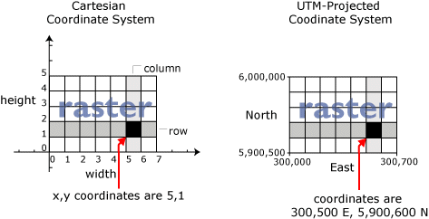

% Utilisation de données raster avec Python
% Clément Delgrange
% 03/2018


# Objectifs

* Apprendre à manipuler des raster avec Python
* Combiner des données raster et vecteur


# L'information géographique raster
Un raster est une image (photographie, plan, modèle numérique de terrain, etc.) géoréférencée.
L'information représentée dans le raster est stockée sous forme de matrices, éventuellement à plusieurs dimensions, où chacune des cellules, aussi appelée **pixel**, est associée à une valeur chiffrée représentant la valeur de l'information.
Cette valeur peut être de différentes natures : bruit, température, altitude, chiffre représentant une classe d'occupation du sol, valeur spectrale représentant une couleur, etc. Une valeur *no_data* peut indiquer qu'aucune information n'est connue pour un pixel.

Un raster se caractérise notamment par :

* une taille (nombre de lignes et de colonnes);
* un nombre de canaux;
* une taille terrain d'un pixel ou résolution;
* un type pour les valeurs de pixels (entier positif/relatif, nombre à virgule);
* une valeur de *no_data*;
* un format.

Parmi la nombreuse liste de formats, propriétaires ou ouverts, nous les formats images classiques et quelques formats spécifiques à la géomatique : le tif, l'ecw, le gif, le bmp, l'hdf, etc.

Le traitement et l'analyse des rasters est souvent plus complexe que celle des vecteurs.
Notons par exemple que la récupération des coordonnées spatiales d'un pixel n'est pas automatique.
Celui-ci est référencé à l'intérieur du raster en coordonnées image (position en terme de numéros de ligne et de colonne).
Seules les coordonnées spatiales d'un coin du raster sont connées.
Les coordonnées spatiales du pixel sont ensuite recalculées à partir des coordonnées du coin, de coordonnées images du pixel, de la résolution et de l'orientation du raster (angle avec le nord).



GDAL est la librairie fondamentale de gestion des rasters en géomatique.
Son développement est supportée par l'OSGeo.

\begin{note}
Avec PROJ.4, pour les reprojections, GEOS, pour la manipulation de géométries vecteur, GDAL est la troisième librairie fondamentale de la géomatique.
\end{note}

Si GDAL est écrite en C, un binding Python existe : `osgeo.gdal`.
L'exemple suivant permet d'ouvrir un raster `osgeo.gdal` et d'afficher ses métadonnées :
```
from osgeo import gdal
gtif = gdal.Open("raster.tif")
print(gtif.GetMetadata())
```

Malheureusement, la syntaxe de cette librairie n'est pas très intuitive et son utilisation se révèle souvent assez complexe[^1]. Aussi, d'autres outils on vu le jour et proposent des interfaces plus pythoniques pour manipules de raster géoréférencés.
La librairie la plus utilisée est certainement `rasterio`.

[^1]: voir le livre d'exemples : <https://pcjericks.github.io/py-gdalogr-cookbook/>.

Le contenu des différentes bandes du raster sont directement stockées dans des tableau `numpy`.
Dans l'exemple ci-dessous nous récupérons la valeur de chacune des bandes RGB d'un raster pour ensuite les afficher individuellement.
```
import rasterio
import matplotlib.pyplot as plt

with rasterio.open('RGB.tif') as src:
    r, g, b = src.read()

plt.imshow(r, cmap='gray')
plt.show()
```

Pour accéder au métadonnées d'un raster :
```
with rasterio.open('RGB.tif') as src:
    print(src.width, src.height)
    print(src.crs)
    print(src.transform)
    print(src.count)
    print(src.indexes)
```


## Exercices
Créer un masque de l'orthographie `ortho.tif` où les pixels ne peuvent prendre que deux valeurs :

* 255 si la somme des trois bandes (rouge, vert et bleu) est supérieure à 300;
* 0 sinon.


# Combiner données raster et vecteur
Superposer des données raster et vecteur pour effectuer des analyses uniquement à l'aide de la programmation est souvent un exercice périlleux.
Cela peut l'être encore plus si les données sont exprimées dans des systèmes de coordonnées différents.
En effet un raster est géoréférencé globalement (classiquement on connaît les coordonnées spatiales de l'emprise du raster) mais les coordonnées des pixels sont exprimées en coordonnées images (ligne-colonne).
Aussi le processus de recalage d'un vecteur sur un raster, qui consiste à déterminer les coordonnées images des points de la géométrie, nécessite d'effectuer quelques calculs mathématiques.
Ces opérations qui permettant d'effectuer la transformation coordonnées spatiales vers coordonnées images, si elles ne sont pas d'une complexité monstrueuse sont rarement implémentées dans les libraires que nous utilisons.

Une librairie comme `buzzard` (<https://github.com/airware/buzzard/>) vise à faciliter la gestion des données géospatiales de différents type et dans différentes projections, en offrant un interface très pythonique à l'utilisateur.

L'exemple suivant calcule les coordonnées images d'une ligne :
```
import buzzard as buzz

ds = buzz.DataSource()
ds.open_raster("ortho", "ortho.tif")
ds.open_vector("line", "linestring.shp")

spatial_coords = ds.line.get_data(0, None, geom_type="coordinates")
img_coords = ds.ortho.spatial_to_raster(spatial_coords)
```


# Exercice final
Consignes :

* Les données `stock.shp` représentent des polygones;
* Le raster `DSM.tif` est un MNT;
* Pour chacun des polygones, il s’agit de calculer l'altitude minimale du MNT sous son emprise.
* Le résultat est inscrit dans la données d'entrée.


# Références

* Introduction à `numpy` : <http://www.courspython.com/apprendre-numpy.html>
