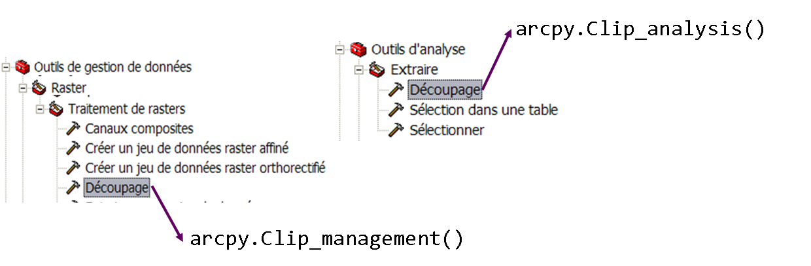
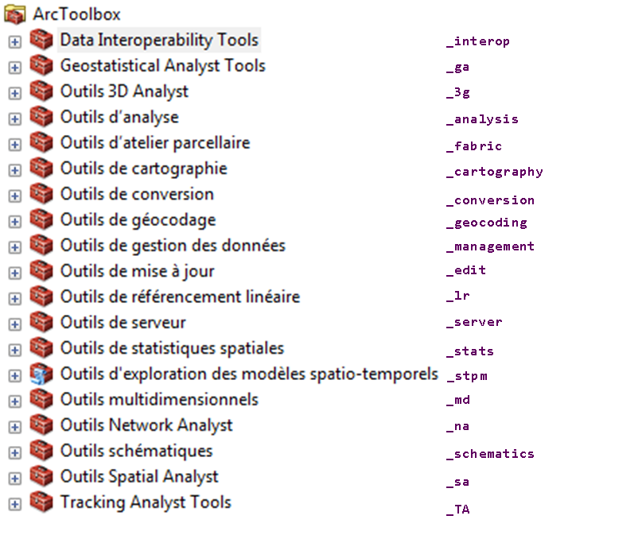

% Programmation sous SIG - ArcPy
% Clément Delgrange
% 2018


# Manipulation des outils de géotraitement #

## Chargement de boîtes à outils ##
Toutes les boîtes à outils (*ArcToolbox*) peuvent être appellées en Python. Pour distinguer les outils de même nom, mais dans des boîtes différentes, le nom de l'outil est suivi de l'alias de la boîte.



L'ensemble des alias sont listés ci-dessous.



Par défaut, le package arcpy ne reconnaît que les outils des boîtes à outils système. Pour utiliser une autre outil (stockée dans un répertoire ou une géodatabase par exemple), sa boîte à outils doit préalablement avoir été importée dans arcpy à l'aide de la commande `ImportToolbox()` :

``` python
arcpy.ImportToolbox(".../maToolBox.tbx")
```

Pour éviter les confusion avec des outils existants, nous recommanderons donc d'également donner des alias aux boîtes personnelles. Une boîte à outil devenue inutile peut être supprimée :

``` python
arcpy.RemoveToolbox(".../maToolBox.tbx")
```

## Utilisation d'outils de géotraitement ##
Pour tous les outils système, la syntaxe est la même. Les paramêtres entre accolades sont optionnels, les autres sont obligatoires. Des listes de valeurs possibles peuvent être précisées pour les paramètres optionnels. Dans ce cas, la valeur par défaut est indiquée en premier.

``` python
NomDeLOutil(argument, {argument optionnel}, {valeur par défaut | autre valeur possible})
```

Par exemple, pour l'outil `Buffer` de la boîte à outils d'analyse, la documentation indique :

``` python
Buffer_analysis(in_features, out_feature_class, buffer_distance_or_field, {line_side}, {line_end_type}, {dissolve_option}, {dissolve_field}, {method})
```

Pour calculer le buffer d'un réseau routier (couche *Routes*) en fonction de l'attribut `LARGEUR`, des deux côtés des linéaires et sans assembler les surfaces résultantes se chevauchant, nous pourrons ainsi écrire :

``` python
arcpy.Buffer_analysis("Routes", "D:\Routes_buffer.shp", "LARGEUR", "FULL")
```

Si la couche *Routes* ou le fichier de forme doivent être réutilisés ailleurs dans le script, nous utiliserons des varialbes pour stocker ces valeurs :

``` python
layer_routes = "Routes"
shp_routes_buffer = "D:\Routes_buffer.shp"
arcpy.Buffer_analysis(layer_routes, shp_routes_buffer, "LARGEUR", "FULL")
```

Pour utiliser la valeur par défaut d'un paramètre optionnel, ou pour ne pas passer de valeur à ce paramètre, nous pouvons utiliser un champ vierge : `""`. Par exemple, pour créer une classe d'entités `Route` dans la géodatabase `D:\Travail\Lyon.gdb` et en utilisant la référence spatiale de la couche

``` python
arcpy.CreateFeatureClass_management(r"D:\Travail\Lyon.gdb", "Route", "POLYLINE", "", "", "", "RGF_1993_Lambert_93")
```

## Cas des requêtes SQL ##

Cas des requêtes SQL et requêtes SQL avec paramètres

La forme de la requête dépend du type de classe d'entités dont il s'agit. Sur une fichier de forme nous écrirons par exemple `"NAME" = 'Toronto'`, alors que pour une classe d'entités de géodatabase la requête serait `[NAME] = 'Toronto'`.


## Définir l'environnement ##
Le module `env` d'ArcPy est utilisé pour définir l'environnement d'exécution des outils de géotraitement (exemple : espace de travail, étendue, référence spatiale, etc.). Par exemple, pour définir l'espace de travail :

``` python
arcpy.env.workspace = r"D:\Travail\Lyon.gdb"
```

Le paramétrage de l'environnement de géotraitement impacte l'exécution des outils. La liste complète des paramètres d'environnement accessibles dans ArcPy est consultable sur l'aide en ligne : <http://desktop.arcgis.com/fr/arcmap/10.3/analyze/arcpy-classes/env.htm>

Dans ArcPy, la fonction `ListEnvironnements()` liste l'ensemble des paramètres d'environnement.

``` python
envs = arcpy.ListEnvironnements()
for e in envs:
	print(e, arcpy.env[e])
```

## Résultats des géotraitements ##
Pour les outils de géotraitement retournant des résultats

`getOutput(index)` renvoie la sortie à l'index donné.

``` python
getOutput(index)
```


# Méthodes intégrées à ArcPy #

Le package ArcPy permet d'autres tâches que le géotraitement. Il possède des classes et fonctions qui ne sont ni des outils, ni des paramètres d'environnement. ArcPy est composé de cinq modules que nous étudierons en partie dans les chapitres suivants :

* Module de cartographie (`arcpy.mapping`) : ouvrir et manipuler le document ArcMap
* Module de manipulation de données (`arcpy.da`) : gestion des tables et classes d'entités, recherche et mise à jour des données
* Module d'analyse spatiale (`arcpy.sa`) : outils traditionnels d'analyse spatiale
* Module d'analyse de réseaux (`arcpy.na`) : outils de l'extension Network Analyst
* Module temporel (`arcpy.time`) : travailler avec des intervalles de temps


## Manipulation du document ArcMap ##

### Le document ArcMap ###
Le document ArcMap (le .mxd) est représenté à l'aide de l'objet `MapDocument` du module `mapping`. Il existe deux manière d'instancier cet objet :

* `arcpy.mapping.MapDocument("current")` si le script est exécuté depuis ArcMap;
* `arcpy.mapping.MapDocument(<chemin_vers_le_mxd>)` si le script est exécuté à l'extérieur d'ArcMap.

Propriétés de l'objet `MapDocument` :

* `activeView` : nom du bloc de données actif, ou "PAGE_LAYOUT" si on est en mode mise en page
* `filePath` : chemin complet du mxd
* `author`, `description`, `title`, etc.

Méthodes de l'objet `MapDocument` :

* `save()` pour sauvegarder le mxd
* `saveACopy(file_name)` pour sauvegarder le document dans un nouveau mxd

### Le bloc de données ###
L'objet `DataFrame`du module `mapping` représente le bloc de données d'ArcMap. La méthode `zoomToSelectedFeatures()` modifie l'étendue de l'affichage pour la faire correspondre avec l'étendue de la sélection du bloc de données.

Dans la pratique, nous utilisons souvent cet objet pour récupérer le premier bloc de données du document. La fonction `ListDataFrames(map_document, {wildcard})` du module `mapping` d'ArcPy retourne la liste des blocs de données dans l'ordre d'affichage de la table des matières. La wildcard permet de limiter la recherche à l'aide de mots clé.

Code pour récupérer le premier bloc de données du document courant :

``` python
mxd = arcpy.mapping.MapDocument("current")
df = arcpy.mapping.ListDataFrame(mxd)[0]
```

### La couche ###
La couche du document ArcMap est représentée par l'objet `Layer` du module `mapping`. Pour instancier un objet `Layer`, nous avons besoin du chemin vers le fichier ".lyr" la référençant :

``` python
lyr = arcpy.mapping.Layer(<chemin_vers_le_lyr>)
```

Dans ArcMap, il existe plusieurs types de couche. Les fonctions `isFeatureLayer()`, `isRasterLayer()` ou `isGroupLayer()` permettent d'identifier le type de l'objet `Layer`.

Propriétés de l'objet `Layer` (certaines propriétés ne sont pas supportées par tous les types de couche) :

* `name` : nom de la couche
* `definitionQuery` : ensemble de définition limitant l'affichage de la couche à un sous-ensemble d'entités
* `symbology` et `symbologyType` : retournent la symbologie de la couche et son type (valeurs uniques, couleurs graduées, autre, etc.)
* `transparency` : pourcentage de transparence de la couche
* `visible` : indique si la couche est visible ou pas

Quelques méthodes peuvent également être utiles :

* `getExtent()` et `getSelectedExtend()` pour retourner l'étendue de la couche ou de la sélection
* `replaceDataSource(workspace_path, workspace_type)` pour mettre à jour la source des données
* `save()` et `saveACopy(file_name)`

Enfin, nous utiliserons souvent la fonction `ListLayers(mxd, {wildcard}, {data_frame})` pour lister l'ensemble des couches d'un document et/ou bloc de données.

Exemple de code pour afficher le nom de toutes les couches vecteur du document courant :

``` python
mxd = arcpy.mapping.MapDocument("current")
df = arcpy.mapping.ListDataFrame(mxd)[0]
lyr_list = arcpy.mapping.ListLayers(mxd, "", df)
for lyr in lyr_list:
    if lyr.isFeatureLayer():
        print(lyr.name)
```

Trois fonctions du module `mapping`permettent d'ajouter une couche à un document :

* `AddLayer(data_frame, layer, {AUTO_ARRANGE | BOTTOM | TOP})` pour l'ajouter dans un bloc de données
* `AddLayerToGroup(data_frame, target_group_layer, add_layer, {AUTO_ARRANGE | BOTTOM | TOP})` pour l'ajouter dans un groupe de couches donné
* `InsertLayer(data_frame, reference_layer, layer, {BEFORE | AFTER})` pour l'insérer avant ou après une couche donnée

`RemoveLayer(data_frame, layer)` permet à l'inverse de supprimer une couche en précisant son bloc de données.  

Une autre solution pour créer une couche et l'ajouter à un document ArcMap coniste à utiliser l'outil *Générer une couche* du jeu d'outils *Couches et vues tabulaires*. Pour une couche vecteur, la syntaxe est :

```python
flayer = arcpy.MakeFeatureLayer_management (in_features, out_layer, {where_clause})`,   
```

`in_feature` étant la classe d'entités à partir de laquelle la nouvelle couche est générée. Une couche créée de cette manière est temporaire et disparait à la fin de l'exécution du script si elle n'est pas enregistrée.


## L'accès aux données ##
Nous rappelons ici que le paramètre d'environnement de géotraitement `workspace` définit l'espace de travail dans lequel les outils et fonctions s'exécutent. Cet espace de travail peut être une géodatabase ou un répertoire.

``` python
arcpy.env.workspace = r"D:\Travail\Lyon.gdb"
arcpy.env.workspace = r"D:\Travail\Donnees"
```

Nous rappelons également ici qu'un espace de travail peut contenir des tables (`Table`), des classes d'entités (`FeatureClass`), des rasters (`Raster`) et, dans le cas d'une géodatabase, des jeux de classes d'entités (`DataSet`).

### Lister des données ###
ArcPy possède un ensemble de fonctions destinées à lister des données dans l'espace de travail courant. Les valeurs sont retournées sous forme de liste de chaînes de caractères. Toutes ces fonctions ont un paramètre optionnnel `wild_card` permettant d'ajouter un filtre sur la recherche (par exemple, lister les classes d'entités se terminant par "*_FR"). Elles permettent toutes également de restreindre le résultat à un type de donnée particulier (géométrie particulière, type d'espace de travail, etc.). Par exemple :

* `ListWorkspaces({wild_card}, {workspace_type})` : lister les espaces de travail à l'intérieur de l'espace de travail courant
	* *workspace_type = FileGDB, Folder, Access...*
* `ListDatasets({wild_card}, {feature_type})` : lister les jeux de classes d'entités
	* *feature_type = Feature, Coverage, Network...*
* `ListFeatureClasses({wild_card}, {feature_type}, {feature_dataset})` : lister les classes d'entités, éventuellement en précisant un jeu de classes d'entités
	* *feature_type = Point, Polygon, Polyline...*
* `ListRasters({wild_card}, {raster_type})` : lister les rasters
	* *raster_type = TIF, JP2, GRID...*
* `ListTables({wild_card}, {table_type})` : lister les tables
	* *table_type = dBASE, INFO*


Ci-dessous nous listons les classes d'entités d'une géodatabase et affichons leur chemin d'accès complet :

``` python
arcpy.env.workspace = r"D:\Travail\Lyon.gdb"
fc_list = arcpy.ListFeatureClasses()
for fc in fc_list:
    path = os.path.join(arcpy.env.workspace, fc)
	  print(path)
```

### Vérifier l'existence ###
La librairie ArcPy fournit une fonction testant l'existance d'un jeu de données (classe d'entités, table, jeu de classes d'entités, etc.): `Exists(dataset)`. Le nom ou chemin d'accès à la ressource est passé, sous forme de chaîne de caractères, en paramètre de la fonction qui retourne un booléen.

Par exemple, pour supprimer, si elle existe, la classe d'entités *Route* de la géodatabase *Lyon.gdb*, écrire :

``` python
arcpy.env.workspace = r"D:\Travail\Lyon.gdb"
if arcpy.Exists("Route"):
		arcpy.Delete_management("Route")
```

### Les champs ###
L'objet `Field` représente une colonne dans une table ou classe d'entités. La liste des champs d'une table peut être renvoyée par la méthode `ListFields()`.

Propriétés des champs :

* *name*
* *aliasName*
* *domain*
* *editable*
* *require*
* *length*
* *type* : *Blob, Date, Double, Geometry, Guid, Integer, OID, Raster, Single, SmallInteger, String*
* *scale*
* *precision*

Ces propriétés sont en lecture/écriture. Pour manipuler de manière plus avancée ces champs (ajout/suppression/calcul de valeur), se tourner vers la boîte à outils Champs.

### Décrire les données ###
La fonction `Describe()` d'ArcPy retourne un objet `Describe` présentant de nombreuses propriétés sur les données (type, champs, index, etc.). Tous les objets peuvent être décrit à l'aide de cette fonction. La liste des propriétés s'adapte en fonction de l'objet décrit.

Par exemple, pour une classe d'entités ou une table, la propriété `fields` de l'objet `Describe` retourne la liste des champs (la même que celle obtenue en utilisant la fonction `ListFields()`).

La liste complète des propriétés de chaque objet est décrite dans la documentation : <http://desktop.arcgis.com/fr/arcmap/10.3/analyze/arcpy-functions/describe.htm>

### Créer des jeux de données ###
Pour créer des jeux de données, utiliser les outils de géotraitement :

``` python
arcpy.CreateFeatureClass_management()
arcpy.CreateFeatureDataset_management()
arcpy.CreateFileGDB_management()
```


## Sélectionner et mettre à jour ##

### Sélections attributaires et spatiales ###
Utiliser les outils de géotraitement :

``` python
arcpy.SelectLayerByAttribute_management(in_layer, {selection_type}, {where_clause})
arcpy.SelectLayerByLocation_namagement(in_layer, {overlap_type}, {select_features}, {search_distance}, {selection_type}, {invert_spatial_relationship})
```

Le paramètre `selection_type` peut prendre les valeurs suivantes :

* *NEW_SELECTION*
* *ADD_TO_SELECTION*
* *REMOVE_FROM_SELECTION*
* *SUBSET_SELECTION*
* *SWITCH_SELECTION*
* *CLEAR_SELECTION*

Les relations spatiales prises en charge sont : *INTERSECT*, *WITHIN_A_DISTANCE*, *CONTAINS*, *WITHIN*, *ARE_IDENTICAL_TO*, etc. Le paramètre `invert_spatial_relationship` permet d'inverser le résultat une fois l'opération spatiale effecutée.

### Les curseurs ###
Un curseur fournit un moyen de parcourir un ensemble d'enregistrements d'une table ou classe d'entités. Trois types de curseurs sont disponibles dans ArcPy : `SearchCursor()`, `UpdateCursor()` et `InsertCursor()`.

Le curseur de recherche possède deux méthodes : `reset()` pour se placer sur le premier élément et `next()` pour avancer à l'élément suivant. Le curseur de mise à jour possède deux méthode supplémentaires pour supprimer ou mettre à jour une ligne (respectivement `deleteRow()` et `updateRow()`). Le curseur d'insertion ne possède qu'une méthode `insertRow(row)` pour insérer une ligne.

Ces curseurs existent en deux versions :

* une dans la base de la librairie ArcPy : `arcpy.curseur(table, {where_clause})`
* une dans le module d'accès aux données d'ArcPy : `arcpy.da.curseur(table, field_names, {where_clause})`

où *curseur = SearchCursor, UpdateCursor ou InsertCursor*

Le curseur du module d'accès aux données se montre plus performant.

Utiliser une boucle *for* et un gestionnaire de contexte (*with*) :

``` python
with arcpy.da.UpdateCursor(fc, ['TYPE_ROUTE', 'LARGEUR']) as cursor:
	for row in cursor:
		if row[0] == 'Autoroute':
			row[1] = 30
		elif row[0] == 'Nationale':
			row[1] = 20
		else:
			row[1] = 10
		cursor.updateRow()
```

L'utilisation d'un curseur sur une table entraine le verrouillage de celle-ci. Il n'est plus possible d'éditer la table par ailleurs. En corollaire, si la table est déjà ouverte en édition, le curseur ne peut pas fonctionner.

### Géométrie des entités vectorielles ###
La géométrie d'une classe d'entités est portée par un champ (généralement nommé *Shape*). Elle peut être de type *Polygon*, *Polyline*, *MultiPoint* ou *PointGeometry*. Pour les entités composées de plusieurs parties, la propriété `partCount` retourne le nombre de parties et la méthode `getPart()` renvoie un tableau des points composant une partie.

La fonction `Describe()` possède une propriété `shapeFieldName` contenant le nom du champ portant la géométrie. La propriété `shapeType` indique le type de géométrie.

L'objet `Point`d'ArcPy est la base de toutes les constructions géométriques. Il possède deux propriétés `X` et `Y`. Une géométrie de type *Pointgeometry* est par exemple construite à partie d'un `Point` :

``` python
pnt = arcpy.Point(42, 56)
pnt_geom = arcpy.PointGeometry(pnt)
```

Toutes les géométries possèdent des attributs communs (area, centroid, extent, firstPoint, etc.) et des méthodes permettant de tester les relations entre elles (`contains()`, `intersect()`, `distanceTo()`, etc.).

Avec les curseurs du module `da`, il est possible d'indiquer un jeton renvoyant des informations sur la géométrie :

* *SHAPE@* : objet *Geometry*
* *SHAPE@XY* : tuple des coordonnées (x, y) du centroid
* *SHAPE@X* : coordonnée x
* *SHAPE@Y* : coordonnée y
* *SHPAE@Z* : coordonnées z
* *SHAPE@TRUECENTROID* : tuple des coordonnées (x, y) du vrai centroid
* *SHAPE@AREA* : aire
* *SHAPE@LENGTH* : périmètre

Cela donne par exemple pour une insertion :

``` python
fc : r"D:\Travail\Eglise.shp"
row_values = ("Notre-Dame", (48.85, 2.35))
with arcpy.da.InsertCursor(fc, ['NOM', 'SHPAE@XY']) as cursor:
	cursor.InsertRow(row_values)
```


### Utilisation de géométrie dans les géotraitements ###
Les objets `Geometry` peuvent être utilisées en entrée et en sortie des outils de géotraitement.

Exemple en entrée :

``` python
array = arcpy.Array()

coordinates = [[1.0, 1.0], [1.0, 10.0], [10.0, 10.0], [10.0, 1.0], [1.0, 1.0]
for x, y in coordinates:
    pnt = arcpy.Point(x, y)
    array.add(pnt)

boundary = arcpy.Polygon(array)

arcpy.Clip_analysis('c:/data/rivers.shp', boundary, 'c:/data/rivers_clipped.shp')
```

Exemple en sortie :

``` python
geometries = arcpy.CopyFeatures_management('c:/temp/outlines.shp', arcpy.Geometry())

area_list = [g.area for g in geometries]
area = sum(area_list)

print('Aire totale = {}'.format(area))
```


## Affichage et mise en page ##
`arcpy.RefreshTOC()`

`arcpy.RefreshActiveview()`


# Scripts #
## Ajouter des messages ##
ArcPy propose plusieurs méthodes pour faire apparaître des messages dans la fenêtre Python ou dans la fenêtre d'exécution d'une outil. Il peut s'agir de messages d'information, d'alerte ou d'erreur.

* `arcpy.AddMessage(message)` affiche un message simple
* `arpcy.AddWarning(message)` affiche un message d'avertisement
* `arpcy.AddError(message)` affiche un message d'erreur

Boîte de dialogue affichant des informations sur l'avancement (message, barre d'avancement) :

``` python
SetProgressor(type, {message}, {min_range}, {max_range}, {step_value})
```


## Gestion des entrées/sorties ##
Pour récupérer les paramètres passés à un script ArcPy, nous pouvons utiliser la fonction `arcpy.GetParameterAsText(i)`. Elle est identique à l'instruction `sys.argv[i]` mais ne nécessite pas d'importer la librairie `sys`. L'indexation des paramètres (le `i`) commence à 0.

Notons également que la méthode `GetParameter()` permet de récupérer directement un objet passé en paramètre du script plutôt que la chaîne de caractère le décrivant.

De la même manière, les méthode `SetParameter()` et `SetParameterAsText()` sont utilisées pour gérer le sorties.
