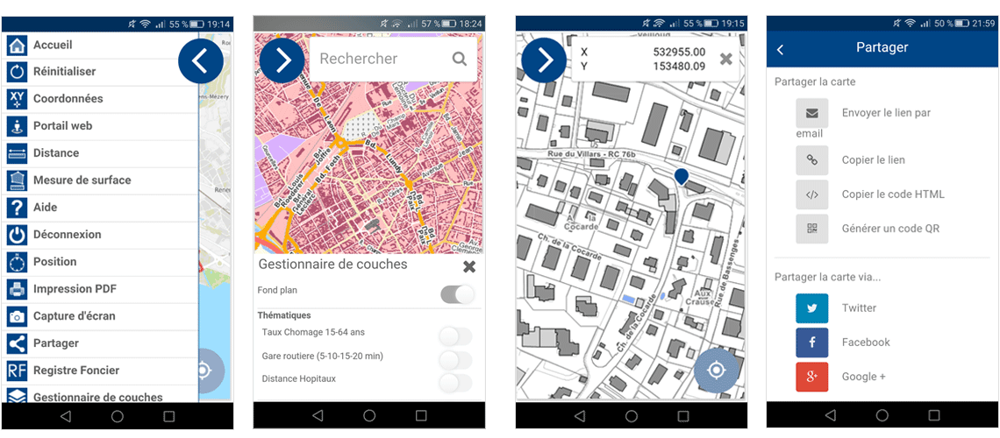
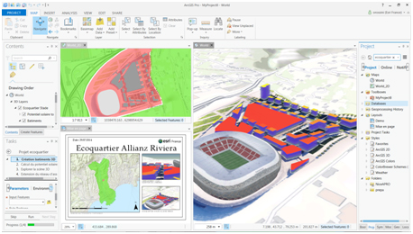
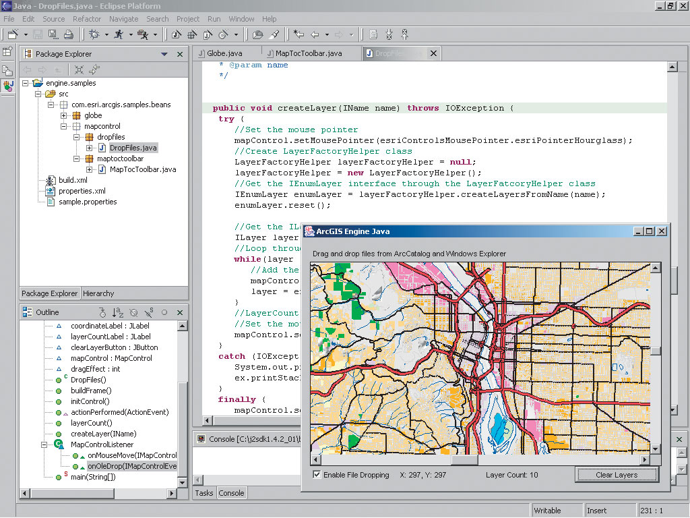
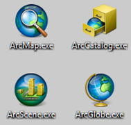
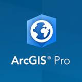
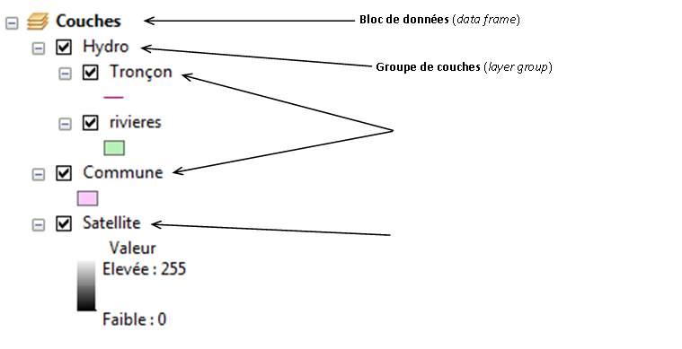
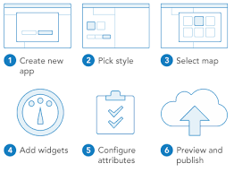
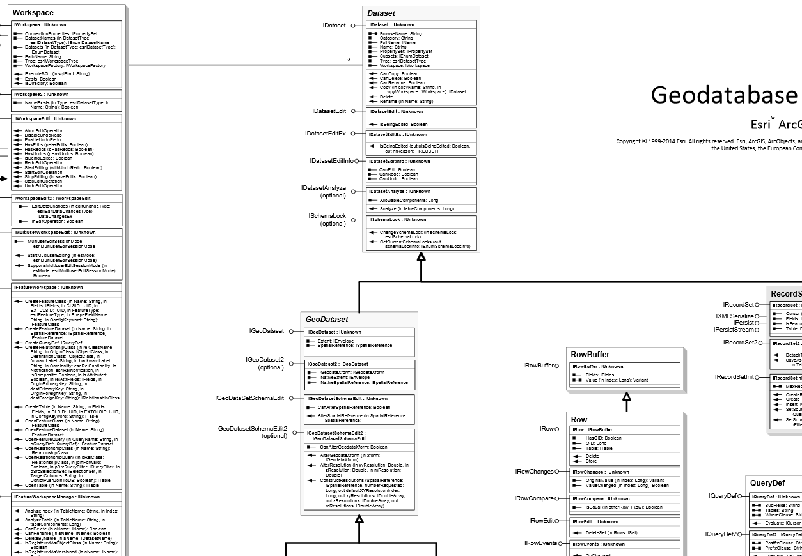
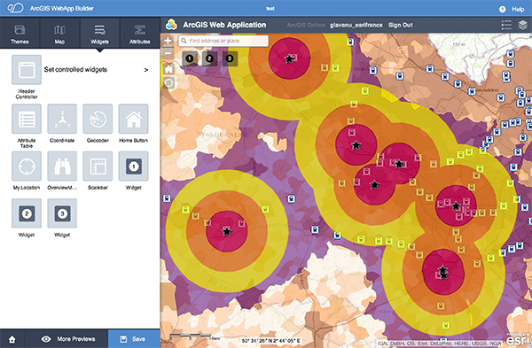

% Programmation sous SIG
% ENSG
% 2017

# Introduction #

## Organisation du cours ##

* 8 séances de TD
* QCM noté lors de la dernière séance

## Programme ##

1. Qu'est qu'un SIG ?
2. Quels développements sous SIG ?
3. Le système ArcGIS
4. ArcGIS pour le développeur

# Généralités #

## Définition ##

> Un système d'information géographique (SIG) est un ensemble organisé de ressources pour collecter, stocker, traiter et diffuser de l'information géographique.

## Composantes d'un SIG ##

* Des aspects multiples
	* **composante technologique** : logiciels, données, matériels
	* **composante organisationnelle** : personnes, savoirs-faire
* Des fonctionnalités communes : *règle des 5A*

## Les 5A ##

* **Acquisition** : collecter de la données sous forme numérique
* **Affichage** : restituer graphiquement l'information
* **Abstraction** : rendre compte de la modélisation de la réalité
* **Analyse** : réaliser des études
* **Archivage** : stocker les données dans un SGBD

			
## Evolution des SIG ##

* 1970 : SIG bureautique réservé aux spécialistes
	* "faire des cartes"
* 1980-90 : diffusion dans d'autres corps de métiers
	* armée, cadastre...
* 2000 : démocratisation de l'information géographiques
	* sites comme GoogleMap
* Aujourd'hui : grand public consommateur régulier d'information géographique
	* usages multiples (géolocalisation, calculs d'itinéraires...)
	* plateformes variées (PC, smartphone...)
	* nombreux utilisateurs

## Les besoins ##

* Grand public consommateur régulier d'information géographique...
* Mais pas de compétence SIG
* => besoin d'une information géographique facilement exploitable
	* développements, programmation
	* infrastructures évoluées (serveurs SIG)

# Le serveur SIG #
##  ##

* Fonctionnalités attendues d'un serveur SIG
	* Héberger des ressources SIG
	* Publier des ressources SIG
	* Permettre d'interagir avec les ressources SIG

## Partage de ressources ##			

* Ressources partagées sous forme de **services**

## Des architectures de serveur SIG ##

## Des architectures de serveur SIG ##

# Développements sous SIG #

## Intérêt des développements ##

* Répondre aux besoins non couverts en standard
 	* faciliter des opérations
 	* automatiser des géotraitements
	* simplifier des applications métier
	* *sortir le SIG du bureau*
	* ...

## Types de développements ##

* Développements bureautiques
	* personnalisation
	* automatisation
	* extensions
	* création d'applications
* Développements de solutions web
* Développements de solutions mobiles

## Quels SIG pour développer ##

* Des interfaces de développement dans tous les SIG

## Quels SIG pour développer ##

## Quels SIG pour développer ##

## Quels SIG pour développer ##

## Quels SIG pour développer ##

* Pourquoi ArcGIS pour ce cours ?
	* ...

# Le système ArcGIS #

##  ##

## Solutions bureautiques ##

| Le SIG bureautique historique | Le viewer gratuit | Les applications métier |
|:-----------------------------:|:-----------------:|:-----------------------:|
| *ArcGIS for Desktop*          | *ArcGIS Explorer* | *ArcGIS Engine*         |
|  |  |  |

## ArcGIS for Desktop ##

* 5 applications

|  |  |
|:-------------------------------------------------:|:---------------------------------------:|
| *Suite ArcMap*                                    | *ArcGIS Pro*                            |

## ArcGIS for Desktop ##
	
* Applications disponibles en 3 niveaux de fonctionnalités
	* Basic (*ArcView*) => faire des cartes, géotraitements simples
	* Standard (*ArcEditor*) => outils d'édition, géodatabases avancées
	* Advanced (*ArcInfo*) => géotraitements avancés (ex : topologie)
* +des extensions
	* *Spatial Analyst*, *Data Interoperability*...

## Un peu de vocabulaire ##

* Du côté "données"

## Un peu de vocabulaire ##

* Du côté **document ArcMap** (*map document* / mxd)

## Les géodatabases ##

| Caractéristique			| Géodatabase personnelle	| Géodatabase fichier		| Géodatabase entreprise	|
|:--------------------------|:--------------------------|:--------------------------|:--------------------------|
| Format					| Fichier Access			| Système de fichiers		| Système de fichiers		|
| Taille max				| 2 Go						| Quasi illimitée			| Illimitée					|
| Utilisateurs en lecture	| < 10						| < 50						| Multi-utilisateur			|
| Utilisateurs en écriture	| 1 seul					| 1 par jeu de données		| Multi-utilisateur 		|

> Nous n'utiliserons quasiment jamais de géodatabase personnelle. 

## ArcGIS Entreprise ##

* ArcGIS Entreprise == ArcGIS for Server
* Serveur SIG complet
	* *héberger*
	* *partager*
	* *créer des applications web SIG*

## ArcGIS Entreprise (ArcGIS for Server) ##

* 3 niveaux de fonctionnalités
	* Basic
	* Standard
	* Advanced
* 2 niveaux de capacité
	* Workgroup (10 utilisateurs, 10GB, 4 coeurs)
	* Enterprise (*"illimité"*)

## Les services ArcGIS ##

<table style="font-size: 12pt">
<colgroup>
<col style="width: 15%" />
<col style="width: 44%" />
<col style="width: 39%" />
</colgroup>
<thead>
<tr class="header">
<th style="text-align: left;"><strong>Type de service</strong></th>
<th style="text-align: left;"><strong>Fonctionnalités disponibles</strong></th>
<th style="text-align: left;"><strong>Ressource SIG</strong></th>
</tr>
</thead>
<tbody>
<tr class="odd">
<td style="text-align: left;">Carte</td>
<td style="text-align: left;">Cartographie Accès aux données Analyse de réseau WCS, WFS, WMS, KML</td>
<td style="text-align: left;">Document ArcMap (.mxd) Définition de service de carte (.msd)</td>
</tr>
<tr class="even">
<td style="text-align: left;">Géocodage</td>
<td style="text-align: left;">Géocodage</td>
<td style="text-align: left;">Localisateur d'adresses (.loc, .mxs)</td>
</tr>
<tr class="odd">
<td style="text-align: left;">Géodonnées</td>
<td style="text-align: left;">Géodonnées Accès aux données</td>
<td style="text-align: left;">Géodatabase fichier Fichier de connexion à une base de données (.sde)</td>
</tr>
<tr class="even">
<td style="text-align: left;">Géotraitement</td>
<td style="text-align: left;">Géotraitement</td>
<td style="text-align: left;">Boite à outils</td>
</tr>
<tr class="odd">
<td style="text-align: left;">Globe</td>
<td style="text-align: left;">Globe</td>
<td style="text-align: left;">Document ArcGlobe (.3dd)</td>
</tr>
<tr class="even">
<td style="text-align: left;">Imagerie</td>
<td style="text-align: left;">Traitement d'image WCS, WMS</td>
<td style="text-align: left;">Jeu de données raster Mosaïque ou fichier de couche faisant référence à un jeu de données raster ou mosaïque</td>
</tr>
</tbody>
</table>

## Utiliser des ressources ArcGIS ##

* Services exposés via 4 protocoles
	* REST
		* `http://server_name:6080/arcgis/rest/services/service_name`
	* SOAP
	* KML
	* OGC

## Options de déploiement ##

* Client léger
	* Application web *clé en main*
	* Application mobile
	* ...
* Client lourd compatibles
	* ArcMap, ArcGIS Pro
* Développement d'un client riche avec les APIs web

			
## Architecture ArcGIS for Server ##

## Portal for ArcGIS ##

* Intermédiaire entre le serveur et les clients
	* Administrer
	* Partager
	* Créer des cartes
	* Créer des applications

## Portal for ArcGIS ##

			
			
## ArcGIS Online ##

* <http://www.arcgis.com>	
* Un SIG dans le cloud
	* gestion collaborative de cartes et services géographiques
	* serveur SIG sur le web

## ArcGIS Online ##

				
## Les solutions mobiles ##

* Gammes d'outils du professionnel au grand public
	* ArcPad
	* ArcGIS Mobile
	* ArcGIS for Smartphones
	* Collector for ArcGIS

## Les générateurs d'applications ##

## Des applications clés en main ##

* 

## Coût des licences ##

* ArcMap :
    * Advanced : 7000€
    * Standard : 5000€
    * Basic : 1000€
* ArcGIS Entreprise (Workgroup) :
	* Basic : 1000€
* ArcGIS Entreprise (Entreprise) :
	* Advanced : 20000-30000€
* ArcGIS Online :
	* 10 jetons = 1€
	* Feature Service Storage : 10MB = 2,4 jetons
	* Tile and data storage : 1GB = 1,2 jetons
* plus la maintenance...

# ArcGIS pour le développeur #

## Familles d'APIs et SDKs ##

* 4 grandes familles
	* APIs Python
	* ArcGIS Runtime  et API ArcObjects
	* APIs web
	* APIs mobiles

## APIs Python ##

* ArcGIS API for Python
	* faire des carte, de l'analyse spatiale
* Arcpy
	* automatiser des géotraitements
	* étendre les applications bureautiques

## L'API ArcObjects ##

* API fondamentale d'ArcGIS
	* ArcObjects = composants de base d'ArcGIS (*composants COM*)
	* Création d'extensions ou d'applications autonomes
	* Consomable via différents SDKs

## ArcGIS Runtime ##

* Remplaçant des ArcObjects
* Indépendant des composants COM
* Noyau d'exécution et différentes API/SDK pour développer

## ArcGIS Runtime ##

## APIs web ##

* Générateurs d'applications (Web AppBuilder)
* Templates d'applications (Flex et Silverlight)
* 3 API web
	* ArcGIS for Javascript
	* ArcGIS for Flex
	* ArcGIS for Silverlight
* *Toutes basées sur l'API REST d'ArcGIS for Server*

## APIs web ##

## APIs web ##

